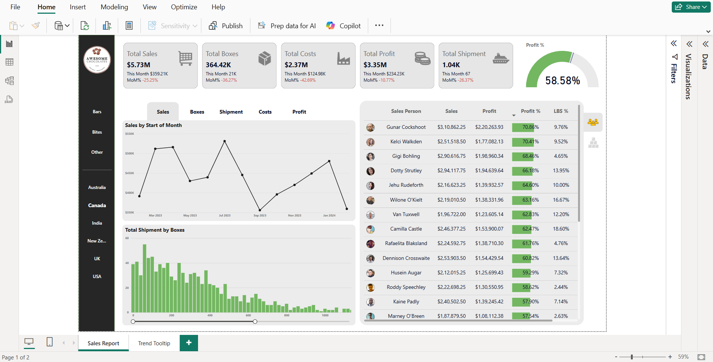
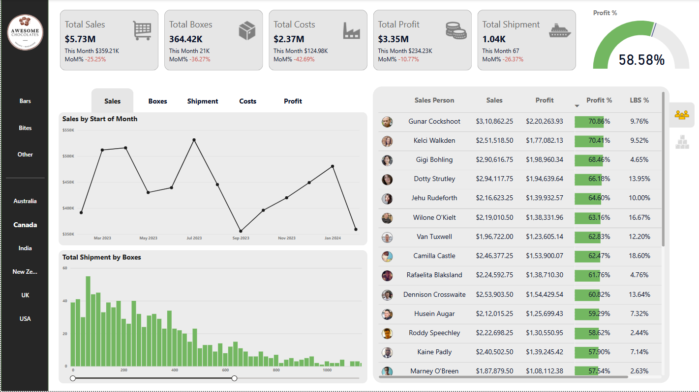
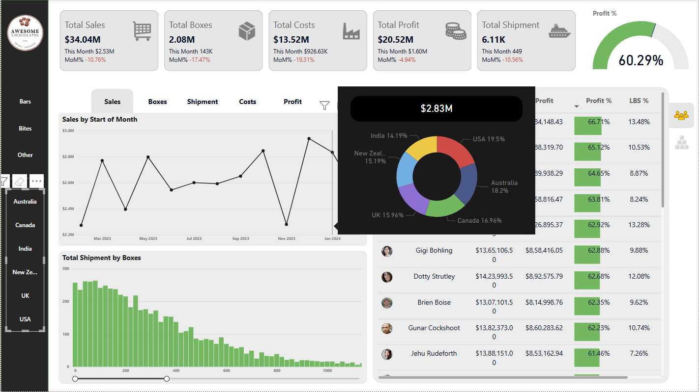

# Awesome Chocolates Sales Dashboard

## Project Overview

This Power BI dashboard analyzes sales performance for **Awesome Chocolates**, a fictional confectionery company. The report focuses on tracking key performance indicators (KPIs) such as **total sales**, **profitability**, **costs**, and **shipment metrics** across different geographies, product categories, and salespersons.

The dashboard is designed to support **monthly business review meetings** by offering dynamic filters, insightful visuals, and interactive slicers that allow users to drill down into specific time periods, products, and sales teams.

---

## Dashboard Screenshots

### Sales Performance Report

### Dynamic MoM KPIs & Visuals

### Country-wise Contribution & Breakdown

---

## Dataset Description

The dashboard is built using multiple interconnected tables following a **star schema model**, with the central fact table containing shipment records and dimensions including products, salespeople, geographies, and calendar data.

### Key Tables:

- **Shipment Data** (6121 rows × 5 columns): Includes shipment info with `Geo`, `Region`, etc.
- **Products** (22 rows): `Product`, `Category`, and `Cost per box`
- **Sales Person** (26 rows): `Sales Person`, `Team`, and image URLs
- **Calendar** (394 rows): Standard `Date` dimension
- **Geo** (6 rows): Maps `Geo` to `Region`

---

## 💡 Features / Insights Shown

- **Total Sales, Costs, Boxes, and Shipments**
- **Profit & Profit %** with conditional formatting
- **Sales Trends Over Time** using line and bar charts
- **Country and Region-wise Breakdown** using slicers and donut charts
- **Month-over-Month (MoM) Change Analysis** using time intelligence
- **Top Salesperson Performance** with KPI ranking
- Interactive elements:
  - Dynamic **field parameters**
  - Custom **tooltips** and **bookmarks**
  - **Zoom sliders** and slicer panels
  - New card visuals with reference labels

---

## Data Source Credits

All data and design elements were originally shared by [Chandoo.org](https://github.com/chandoo-org/Power-BI/) as part of Power BI learning resources. This dashboard is adapted for learning and portfolio purposes.
